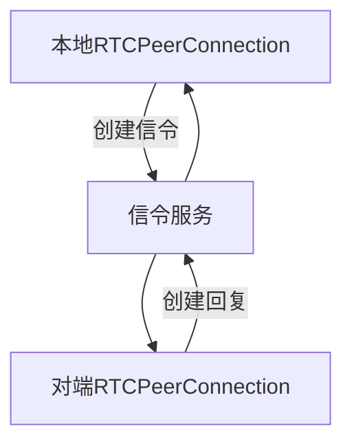

# 初识WebRTC

## 什么是WebRTC

WebRTC（Web Real-Time Communication）是一个开源项目，旨在通过简单的API实现浏览器和移动应用程序之间的实时**音频、视频和数据通信**。WebRTC可以在不需要安装插件或第三方软件的情况下，在浏览器之间直接进行通信。它使用JavaScript、HTML5和Web API等技术实现了端到端的通信。

为浏览器和移动端应用提供了一种：**简单、安全、高效**的**实时通信**的解决方案

本篇文章将通过WebRTC实现一个简单的视频通信，那么WebRTC在这里面担任什么样的角色呢？

1. 交换音视频流：通过`RTCPeerConnection`对象，建立通信双方之间点对点的连接，实现音视频流的交换。
2. 编解码：WebRTC可以将原始音视频数据编码成压缩格式，在网络上传输。接收端通过WebRTC将压缩后的音视频数据解码成原始格式。
3. 信令：虽然WebRTC本身不提供信令协议，但它需要依赖信令来实现会话控制、媒体协商、网络地址发现等功能。开发者可以自由选择合适的信令协议，如SIP、XMPP等，或者自定义信令实现。
4. NAT穿透和ICE：由于网络地址转换（NAT）和防火墙等原因，建立点对点连接可能会遇到一些问题。WebRTC使用Interactive Connectivity Establishment（ICE）框架，结合STUN和TURN服务器，解决了这些连接问题，确保通信的顺利进行。[Coturn 开源的TURN 和 STUN](https://github.com/coturn/coturn)
5. 安全性：WebRTC提供了端到端的安全通信。它使用安全的传输层协议（DTLS）和安全实时传输协议（SRTP）来保护音视频数据的安全性和隐私性。
6. 网络适应性：WebRTC可以根据当前网络状况动态调整音视频编码和传输参数，以提供更好的用户体验。这包括自适应码率、丢包恢复和抗延迟等技术。

## 实现简单的视频通信

在做这个demo之前，我们应该先了解一下如何在浏览器如何通过**Web API**开启摄像头获取视频流或者分屏视频流。

#### API调用注意事项

> 注意：这些API只有在安全源才可以调用，那么什么叫安全源呢[chrome官方文档](https://www.chromium.org/Home/chromium-security/prefer-secure-origins-for-powerful-new-features/)， 下面列举几个

* https
* wss
* localhost
* 127.0.0.1
* 本地系统文件地址
* chrome插件打开的地址

#### getUserMedia获取计算机的摄像头、麦克风

请使用 `navigator.mediaDevices.getUserMedia`，因为~~navigator.getUserMedia~~接口已经废弃了。

```ts
const constraints = {video:true, audio: true} 

const stream = await navigator.mediaDevices.getUserMedia(constraints)

// 关闭
stream.getTracks().forEach(track => {
    track?.stop();
});
```

##### 参数 Constraints

```ts
// 约束分辨率
{
  audio: true,
  video: {
    // max 最大分辨率, ideal 理想分辨率， min 最小分辨率
    width: { min: 320, ideal: 1280, max: 1920 },
    height: { min: 240, ideal: 720, max: 1080 }
  }
}
// 指定分辨率
{
  audio: true,
  video: { width: 720, height: 480}
}
// 移动端指定摄像头 user（前置摄像头）、environment（后置摄像头）
{ audio: true, video: { facingMode: "user" } }
{ audio: true, video: { facingMode: { exact: "environment" } } }
// 指定帧速率， 可以理解为 FPS， 对视频质量与宽带有着影响。网路不好可以限制帧速率
{
  audio: true,
  video: {
    width:1920,
    height:1080,
    frameRate: { ideal: 10, max: 15 }
  }
}
// 使用特定的网络摄像头或者麦克风
// 获取设备所有的媒体
const devices = await navigator.mediaDevices.enumerateDevices()

{
  video: {
    deviceId: 'default'
  }, 
  audio: {
    deviceId: 'default'
  }
} 
```

#### getDisplayMedia分享桌面

```ts
const constraints = {video:true, audio: true} 

const stream = await navigator.mediaDevices.getDisplayMedia(constraints)

stream.getTracks().forEach(track => {
    track?.stop();
});
```

`Constraints`参数与`getUserMedia`基本一样，但是 `video` 不可以设置 `false`

下述代码将实现开启摄像头并通过viode标签展示

```tsx
  const localVideoRef = useRef<HTMLVideoElement>(null);
  const streamRef = useRef<MediaStream>();

  const handleOpen = async () => {
    const constraints = { video: true, audio: false };
    streamRef.current = await navigator.mediaDevices.getUserMedia(constraints);
  };

  const handlePlay = () => {
    if (!localVideoRef.current || !streamRef.current) return;

    localVideoRef.current.srcObject = streamRef.current;
  };

  const handleClose = () => {
    streamRef.current?.getTracks().forEach((track) => {
      track?.stop();
    });
  };
  return (
    <div>
      <Button type="primary" onClick={handleOpen}>
        开启摄像头
      </Button>
      <Button type="primary" onClick={handlePlay}>
        播放
      </Button>
      <Button type="primary" onClick={handleClose}>
        关闭
      </Button>
      <video
        ref={localVideoRef}
        autoPlay
        muted
        style={{ width: '30%', height: 'auto' }}
      />
    </div>
  );

```

## 通信

上面已经讲了如何获取视频，现在我们应该不如本篇文章的核心部分 $通信$，
建立连接步骤如下



#### 核心对象RTCPeerConnection

在现代大部分浏览器已经内置了 **RTCPeerConnection对象**，但各个浏览器实现WebRTC可能会存在差异性，比如支持程度和速度不同，因此WebRTC的API可能存在一些差异和兼容性的问题。所以我们可以使用 **webrtc-adapter（WebRTC适配器）** 来解决该问题。

```ts
npm install webrtc-adapter

import 'webrtc-adapter';
```

当然也可以script标签引入

```html
<script src="https://webrtc.github.io/adapter/adapter-latest.js"></script>
```

`RTCPeerConnection` [构造函数参数](https://developer.mozilla.org/en-US/docs/Web/API/RTCPeerConnection/RTCPeerConnection)在我们的demo中只用到了 `iceServers` 属性

```ts
// iceServers为每个对象描述一个可能被 ICE 代理使用的服务器
// ICE 服务器用于协助建立点对点连接
// 通常会包含一个或多个 STUN 和/或 TURN 服务器
{
  iceServers: [
    // Google提供的公共STUN服务器， 无法在公网进行连接。
    { urls: 'stun:stun.l.google.com:19302' }
  ]
}
```

简单介绍一下ICE
**ICE：Interactive Connectivity Establishment**，交互式连接建立协议，用于在两个主机之间建立连接，它可以在两个主机之间建立连接，即使它们之间的防火墙阻止了直接连接。(可以不借助一个公网 server 完成端到端（Peer to peer，P2P）的通信)。[更多WebRTC 协议介绍](https://developer.mozilla.org/zh-CN/docs/Web/API/WebRTC_API/Protocols)

`RTCPeerConnection`几个发送端核心API

* `addIceCandidate()`:  保存 ICE 候选信息，即双方协商信息，持续整个建立通信过程，直到没有更多候选信息。
* `addTrack()`: 添加音频或者视频轨道。
* `createDataChannel()`: 创建消息通道，建立WebRTC通信之后，就可以 p2p 的直接发送文本消息，无需中转服务器。
* `createOffer()`: 创建初始信令
* `createAnswer()`: 创建应答信令。
* `setRemoteDescription()`: 保存远端发送给自己的信令。
* `setLocalDescription()`: 保存自己端创建的信令。

接收端实例上的监听事件:

* `ondatachannel`: 创建datachannel后监听回调以及 p2p消息监听。
* `ontrack`: 监听远程媒体轨道即远端音视频信息。
* `onicecandidate`: ICE 候选监听。

#### WebRTC的会话流程

我们将通过RTCPeerConnection作为载体，通过载体进行通信，以下流程 **A**为发送端，**B**为接受端

中间信令服务发送信息，我们统一使用websocket,这里不再赘述了。

1. A B链接webSocket， 确定可以通信
2. 确认完通信进行 RTCPeerConnection 对象实例化
3. A调用 `createOffer` 创建信令，同时将这个信令通过`setLocalDescription`保存为本地描述
4. 通过信令服务将 **A** 的信令发送给 **B**
5. B 接收到A的信令，调用`setRemoteDescription`将其保存为远端描述
6. 同时 B 调用 `createAnswer` 创建一个答复信令，并通过`setLocalDescription`将其保存为本地描述， 发送给 A
7. A 接收到 B发来的远端描述，将其通过`setRemoteDescription`保存为远端描述

完成以上步骤 `ontrack` 回调将会被调用，将远端的视频流发送过来。

本文章案例源码
[发送者A](https://github.com/cyd4496623/webrtc-demo/blob/main/locaAudioApi/src/page/Demo-A/index.tsx)

[接收者B](https://github.com/cyd4496623/webrtc-demo/blob/main/locaAudioApi/src/page/Demo-B/index.tsx)

线上体验
[发送者A](https://8.134.67.109/demo-a)
[接收者B](https://8.134.67.109/demo-b)

做了一个简单的demo，WebRTC让web开发者开发音视频通信变得简单。当然有了视频流之后我们可以做一些其他的玩法，比如切换背景，切换背景可以分为: 1. 识别流里的每一帧人物 2. 通过canvas将提取的人物和新背景图进行叠加合成。 这里提供一个[谷歌开源的库MediaPipe](https://developers.google.com/mediapipe/solutions/vision/image_segmenter/)， 当然也有一个简单的案例[切换背景](https://github.com/cyd4496623/webrtc-demo/blob/main/locaAudioApi/src/page/imaginaryBck/index.tsx)

#### 结尾

本篇文章讲述了浏览器之间1:1进行视频通信，如果让我们设计1:n(直播) 或者 n:n(会议室) 又改如何设计?

[参考小册 WebRTC：实现私有化会议直播系统](https://juejin.cn/book/7168418382318927880?scrollMenuIndex=1)
